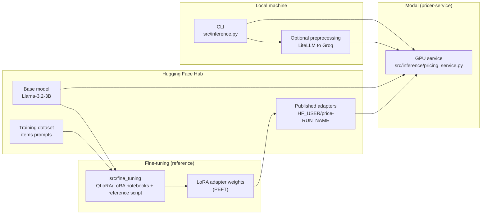

# ai-fine-tuning

This repo shows an end-to-end LLM fine-tuning + serving workflow for a product pricing task: run QLoRA/LoRA fine-tuning notebooks in src/fine_tuning/, then load the adapter for inference.
It deploys a Modal pricing service in src/inference/ and provides a CLI (src/inference.py) to deploy, query prices, use an agent wrapper, and stream logs.

## Architecture (high level)



## Run (`src/inference.py`)

Prereqs:
- `uv` installed
- `uv sync`
- Modal set up (`uv run modal token set ...`)
- Modal Secret created for Hugging Face token (usually named **`huggingface-secret`** with key `HF_TOKEN`)
- `.env` contains your Groq key:
  - `GROQ_API_KEY=...`

Service files:
- **Modal service**: `src/inference/pricing_service.py` (deployed app name: `pricer-service`)
- **Client runner**: `src/inference.py`
- **Inference helpers**: `src/inference/` (agent wrapper + preprocessor)
- **Reference-only training**: `src/training/`
- **Reference-only evaluation**: `src/evaluation/`

Commands (run from repo root):

```bash
# Step 1 (MUST): Deploy the Modal app (do this once, or whenever you change the service code)
uv run python src/inference.py deploy

# Step 2 (choose one): Call the service directly OR use the agent (agent calls the same service)
uv run python src/inference.py price "iphone 10"
uv run python src/inference.py agent "iphone 10"

# Optional: watch the remote Modal logs (this is where container print() output shows up)
uv run python src/inference.py logs
```

Optional: set a different default preprocess model:
- Add to `.env`: `PRICER_PREPROCESSOR_MODEL=groq/openai/gpt-oss-20b` (or another LiteLLM-supported model)

Notes:
- `price` and `agent` both call the same deployed Modal method (`Pricer.price`). If you pass raw text (like `"iphone 10"`), both commands run an LLM-based preprocessor first, which can affect the final price.
- To make repeated runs stable for the same raw input, the preprocessor uses best-effort deterministic settings and a small on-disk cache at `.cache/pricer_preprocess_cache.json`.
  - You can control this with env vars like `PRICER_PREPROCESSOR_TEMPERATURE`, `PRICER_PREPROCESSOR_SEED`, `PRICER_PREPROCESSOR_CACHE`.

## Compare dataset prices vs agent output (optional)

This repo includes a small script that loads **N items from the HF dataset**, extracts each row’s `Title` and ground-truth `Price is $...`, then calls the deployed service via:

- `uv run python src/inference.py agent "<Title>"`

Run (from repo root):

```bash
# Compare 20 test items (default)
uv run python src/compare_dataset_agent_prices.py

# Compare 5 test items
uv run python src/compare_dataset_agent_prices.py --n 5 --split test

# Override dataset (or set PRICER_DATASET_NAME env var)
uv run python src/compare_dataset_agent_prices.py --dataset ed-donner/items_prompts_full --n 5 --split test
```

### Optional integration test (skipped by default)

There is also a smoke test that runs the script, but it is **skipped unless enabled** (it requires network + a deployed Modal app):

```bash
RUN_DATASET_AGENT_COMPARE=1 uv run python -m unittest test.test_compare_dataset_agent_prices
```

## Repo structure (quick guide)

- **`src/inference/`**: all runtime inference/service code (Modal service, agent wrapper, preprocessing)
- **`src/inference.py`**: CLI entrypoint; kept at `src/` so commands stay the same
- **`src/training/`**: reference-only scripts explaining LoRA/QLoRA training (not intended to run locally on Mac)
- **`src/evaluation/`**: reference-only scripts showing baseline evaluation (base model, no LoRA)

## Convert a Colab notebook to a commented Python script (optional)

Because Google Drive/Colab links often require sign-in, the simplest workflow is:

- In Colab: **File → Download → Download `.ipynb`**
- Put the downloaded notebook into this repo (example: `my_notebook.ipynb`)
- Convert it using your preferred tool (for example, `jupytext`) or a simple notebook-to-script exporter.