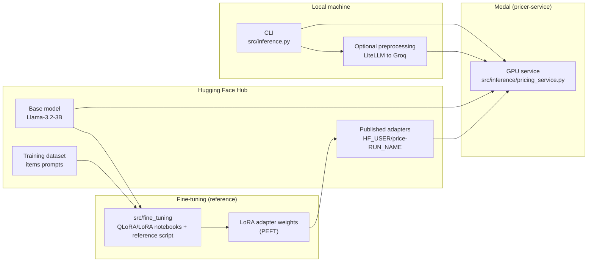

# ai-fine-tuning

This repo shows an end-to-end LLM fine-tuning + serving workflow for a product pricing task: run QLoRA/LoRA fine-tuning notebooks in src/fine_tuning/, then load the adapter for inference.
It deploys a Modal pricing service in src/inference/ and provides a CLI (src/inference.py) to deploy, query prices, use an agent wrapper, and stream logs.

## Architecture (high level)



## Run (`src/inference.py`)

Prereqs:
- `uv` installed
- `uv sync`
- Modal set up (`uv run modal token set ...`)
- Modal Secret created for Hugging Face token (usually named **`huggingface-secret`** with key `HF_TOKEN`)
- `.env` contains your Groq key:
  - `GROQ_API_KEY=...`

Service files:
- **Modal service**: `src/inference/pricing_service.py` (deployed app name: `pricer-service`)
- **Client runner**: `src/inference.py`
- **Inference helpers**: `src/inference/` (agent wrapper + preprocessor)
- **Reference-only training**: `src/training/`
- **Fine-tuning**: `src/fine_tuning/`

Commands (run from repo root):

```bash
# Step 1 (MUST): Deploy the Modal app (do this once, or whenever you change the service code)
uv run python src/inference.py deploy

# Step 2: Call the service (raw input is auto-preprocessed first)
uv run python src/inference.py price "iphone 10"

# Step 3: Run comparison tests of prices using pricer-service (Optional)
uv run python tests/integration/compare_prices.py
```

Optional: set a different default preprocess model:
- Add to `.env`: `PRICER_PREPROCESSOR_MODEL=groq/openai/gpt-oss-20b` (or another LiteLLM-supported model)

Notes:
- `price` and `agent` both call the same deployed Modal method (`Pricer.price`). If you pass raw text (like `"iphone 10"`), both commands run an LLM-based preprocessor first, which can affect the final price.
- To make repeated runs stable for the same raw input, the preprocessor uses best-effort deterministic settings and a small on-disk cache at `.cache/pricer_preprocess_cache.json`.
  - You can control this with env vars like `PRICER_PREPROCESSOR_TEMPERATURE`, `PRICER_PREPROCESSOR_SEED`, `PRICER_PREPROCESSOR_CACHE`.

## Compare dataset prices vs model output (optional)

This repo includes an integration script that loads **N items from the HF dataset**, extracts each row’s `Title` and ground-truth `Price is $...`, then calls the deployed service via:

- `uv run python src/inference.py price "<Title>"`

Run (from repo root):

```bash
# Override dataset (or set PRICER_DATASET_NAME env var)
uv run python tests/integration/compare_prices.py --dataset ed-donner/items_prompts_full --n 5 --split test
```

## Tests

Tests are organized as:

- **Unit tests**: `tests/unit/` (run in CI)
- **Integration tests**: `tests/integration/` (skipped by default; require network + deployed Modal app)

Run unit tests:

```bash
uv run python -m unittest discover -s tests -p "test_*.py"
```

Enable and run integration tests:

```bash
RUN_INTEGRATION_TESTS=1 uv run python -m unittest discover -s tests -p "test_*.py"
```

## Repo structure (quick guide)

- **`src/inference/`**: all runtime inference/service code (Modal service, agent wrapper, preprocessing)
- **`src/inference.py`**: CLI entrypoint; kept at `src/` so commands stay the same
- **`src/training/`**: reference-only scripts explaining LoRA/QLoRA training (not intended to run locally on Mac)
- **`src/fine-tuning/`**: notebooks for fine-tuning (base model, no LoRA)
