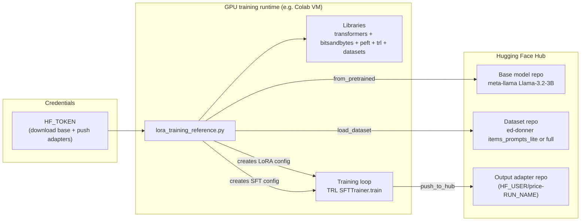
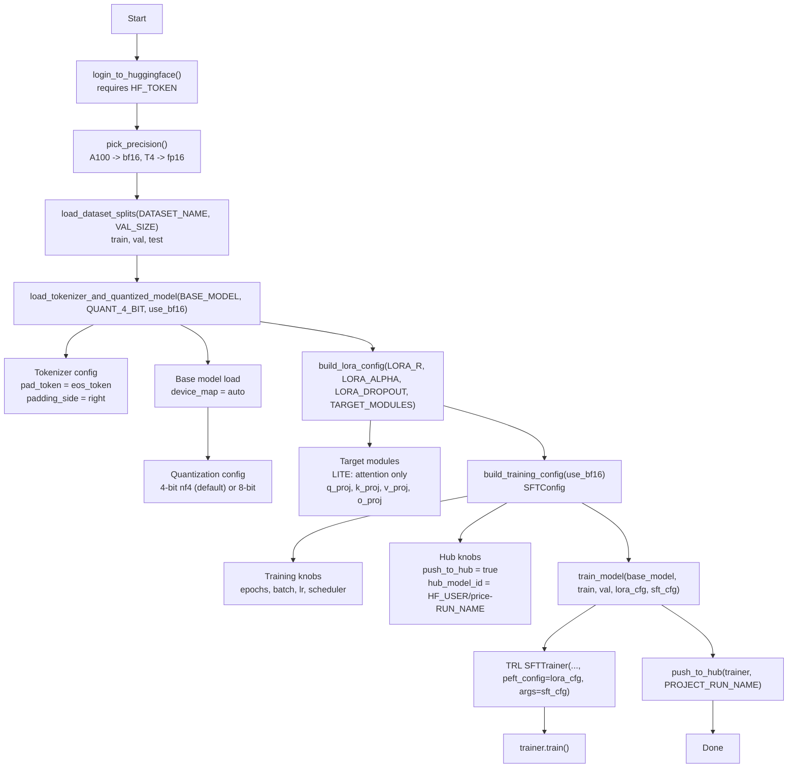

# LoRA / QLoRA fine-tuning workflow (reference)

This repo includes a **reference-only** script that explains the conceptual steps of LoRA / QLoRA training:

- Source: `src/fine_tuning/notebooks/lora_training_reference.py`
- Note: the file explicitly says it is **not meant to be run locally** in this repo (it’s a clean Python walkthrough of what you’d run on a GPU environment like Colab).

## Overall architecture (where things run)

## What “QLoRA” means here (in this script)

In `lora_training_reference.py`, QLoRA is implemented as:

- **Quantize the base model to 4-bit** using bitsandbytes (`BitsAndBytesConfig(load_in_4bit=True, ...)`)
- **Freeze the quantized base weights** (effectively) and **train only LoRA adapter parameters**

So the thing that gets pushed to the Hub is **adapter weights**, not a full copy of the base model weights.

## Workflow diagram (step-by-step)

This diagram mirrors the `main()` function in `lora_training_reference.py`.

## Code walk-through (mapped to the file)

### Inputs (constants)

The script is structured around constants near the top:

- **Base model**: `BASE_MODEL = "meta-llama/Llama-3.2-3B"`
- **Dataset**: `DATASET_NAME = "ed-donner/items_prompts_lite"` (or `..._full`)
- **Quantization**: `QUANT_4_BIT = True` (default)
- **LoRA**:
  - `LORA_R`, `LORA_ALPHA`, `LORA_DROPOUT`
  - `TARGET_MODULES` (lite = attention projections; full can include MLP modules too)
- **Training**:
  - epochs / batch size / max seq length
  - optimizer + scheduler
  - checkpoint cadence (`SAVE_STEPS`, `LOG_STEPS`) and eval slicing (`VAL_SIZE`)
- **Hub output name**:
  - `RUN_NAME` and `PROJECT_RUN_NAME` (timestamped)
  - `HUB_MODEL_NAME = f"{HF_USER}/{PROJECT_RUN_NAME}"`

### Step 0: authenticate with Hugging Face

`login_to_huggingface()` reads `HF_TOKEN` from env and calls `huggingface_hub.login(...)`.

### Step 1: choose fp16 vs bf16

`pick_precision()` checks CUDA capability:

- A100-class GPUs support bf16 well → `use_bf16 = True`
- T4-class GPUs generally use fp16 → `use_bf16 = False`

This flag affects:

- bitsandbytes compute dtype in quantization config
- TRL `SFTConfig(fp16=..., bf16=...)`

### Step 2: load dataset

`load_dataset_splits(DATASET_NAME, VAL_SIZE)` loads Hugging Face Datasets splits:

- `train = dataset["train"]`
- `val = dataset["val"].select(range(VAL_SIZE))`
- `test = dataset["test"]`

### Step 3: load tokenizer + quantized base model (QLoRA)

`load_tokenizer_and_quantized_model(BASE_MODEL, QUANT_4_BIT, use_bf16)`:

- builds a `BitsAndBytesConfig` (4-bit nf4 if `QUANT_4_BIT` else 8-bit)
- loads tokenizer and sets pad token + padding side
- loads base model with `device_map="auto"`

At this point, the base model is ready for LoRA adapter injection/training.

### Step 4: define LoRA adapters (what to train)

`build_lora_config(...)` creates a `peft.LoraConfig` with:

- `task_type="CAUSAL_LM"`
- `target_modules=TARGET_MODULES`

In **LITE_MODE**, adapters are injected into the attention projection layers:

- `q_proj`, `k_proj`, `v_proj`, `o_proj`

### Step 5: define training hyperparameters + hub behavior

`build_training_config(use_bf16)` returns `trl.SFTConfig` including:

- batch/epochs/lr/scheduler/optimizer
- checkpoint + eval schedule
- Hub config: `push_to_hub=True`, `hub_model_id=HUB_MODEL_NAME`, `hub_strategy="every_save"`

### Step 6: train (SFTTrainer)

`train_model(...)` creates `trl.SFTTrainer` with:

- `model=base_model` (quantized)
- `peft_config=lora_cfg` (LoRA adapters to train)
- `args=sft_cfg`

Then it runs `trainer.train()`.

### Step 7: push adapter weights to the Hub

`push_to_hub(...)` calls:

- `trainer.model.push_to_hub(project_run_name, private=True)`

Output is a Hub repo under `HF_USER/price-RUN_NAME` (by default configured via constants).

