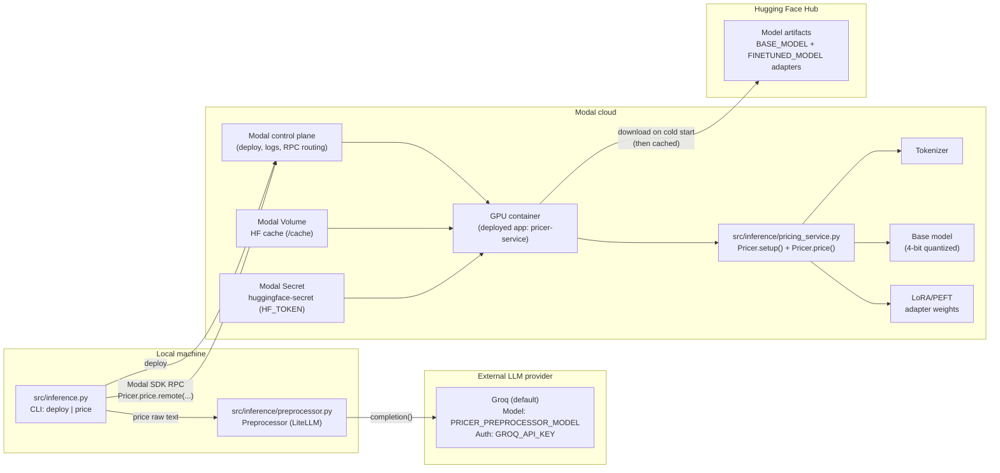
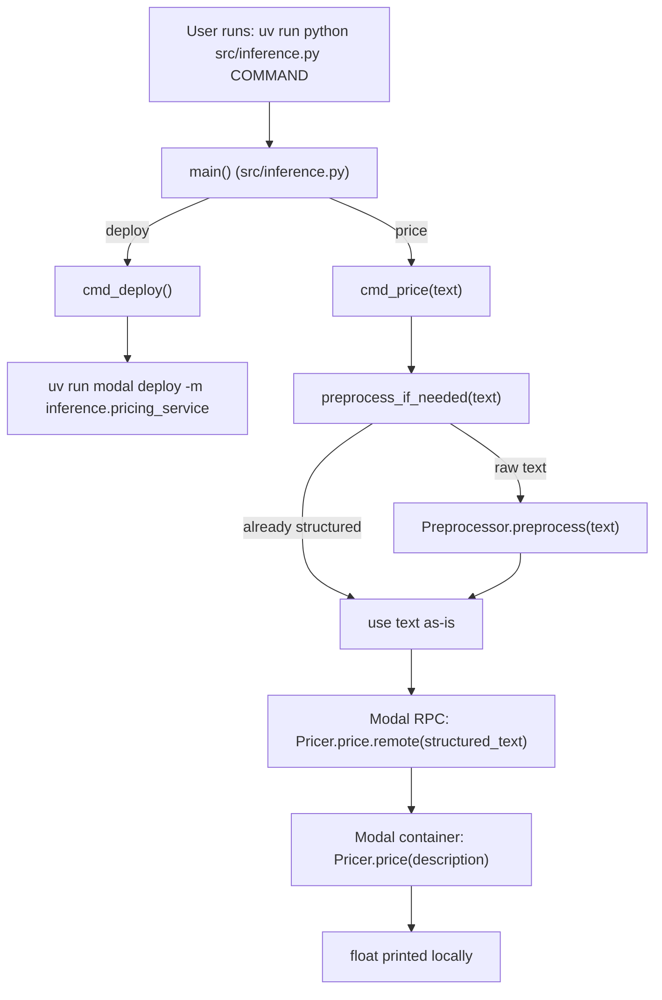
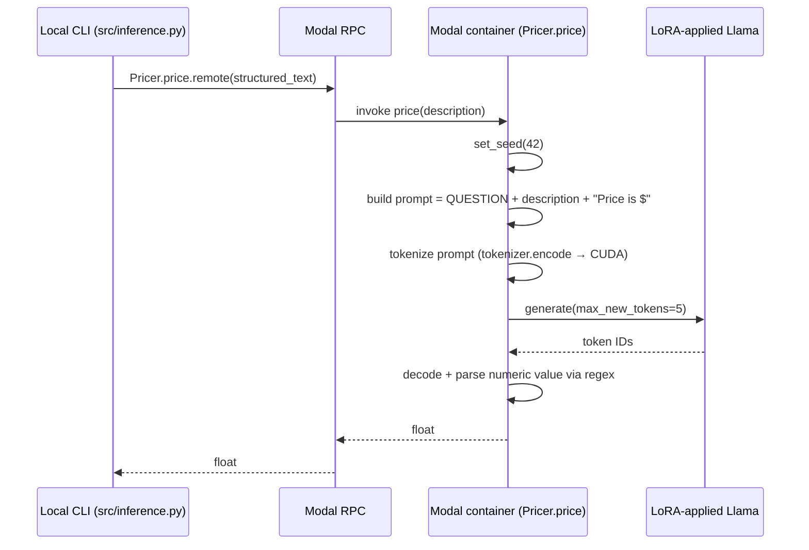

# Inference workflow (`src/inference.py` + `src/inference/`)

This doc is a walkthrough of the **end-to-end inference path** in this repo:

- **CLI entrypoint**: `src/inference.py`
- **Modal service**: `src/inference/pricing_service.py` (Modal app name: `pricer-service`)
- **Preprocessing** (optional): `src/inference/preprocessor.py` (LiteLLM → default Groq model)

## Overall architecture (components + where they run)



## Big picture (what happens when you run a command)



## CLI command dispatch (the surface API)

`src/inference.py` provides two commands via `main()`:

- **`deploy`**: deploy the Modal service module `inference.pricing_service`
- **`price "<text>"`**: preprocess (if needed) and call the deployed service directly

To stream remote container logs (where service `print()` output appears), run:

- `uv run modal app logs pricer-service --timestamps`

## Walkthrough: `deploy`

When you run:

```bash
uv run python src/inference.py deploy
```

`cmd_deploy()` executes:

- `uv run modal deploy -m inference.pricing_service`
- working directory: `src/` (so `-m inference.pricing_service` resolves correctly)

### What gets deployed

In `src/inference/pricing_service.py`:

- A Modal app is defined as `modal.App("pricer-service")`
- A container image is built with ML deps (Transformers, bitsandbytes, PEFT, etc.)
- A `Pricer` class is registered with `@app.cls(...)`, including GPU selection and a Hugging Face cache volume

### What happens on container startup (cold start)

On container start, Modal calls `Pricer.setup()` because it is decorated with `@modal.enter()`.
That method loads **once per container**:

- **Tokenizer**: `AutoTokenizer.from_pretrained(BASE_MODEL)`
- **Base model** (4-bit quantized): `AutoModelForCausalLM.from_pretrained(..., quantization_config=..., device_map="auto")`
- **LoRA adapter weights** applied to base model: `PeftModel.from_pretrained(self.base_model, FINETUNED_MODEL, revision=REVISION)`

This setup is why inference can be fast after the container is warm: the heavy model loads are not repeated per request.

## Walkthrough: `price "<text>"`

When you run:

```bash
uv run python src/inference.py price "iphone 10"
```

the flow is:

1) `cmd_price(text)` calls `preprocess_if_needed(text)`  
2) The processed text is sent to the deployed Modal class method via:  
   `Pricer = modal.Cls.from_name("pricer-service", "Pricer")` then `pricer.price.remote(processed)`
3) The returned `float` is printed locally

### The preprocessing gate (`preprocess_if_needed`)

`preprocess_if_needed(text)` checks whether the input already looks like the structured format your fine-tuned model expects.

It counts lines starting with these prefixes (case-insensitive):

- `Title:`
- `Category:`
- `Brand:`
- `Description:`
- `Details:`

If it sees **3 or more** of those fields, it treats the input as already structured and skips preprocessing.

Otherwise, it calls `Preprocessor().preprocess(text)` (LiteLLM) to rewrite raw text into the structured format.

### Why raw text can yield different answers

The deployed model inference is seeded (`set_seed(42)` in `Pricer.price`), so **given the same structured text**, the output should be stable.

If you pass raw text, the **preprocessor is an LLM call**, and changes in its output will change the prompt sent to the fine-tuned model, which can change the predicted price.

## What the Modal service does per request (`Pricer.price`)

Once `cmd_price` reaches the deployed service, `Pricer.price(description)`:



Key implementation details:

- **Prompt format**:
  - `QUESTION = "What does this cost to the nearest dollar?"`
  - `PREFIX = "Price is $"`
  - prompt is `QUESTION\n\n{description}\n\n{PREFIX}`
- **Generation budget**: `max_new_tokens=5` (small, to emit a short price)
- **Parsing**: splits on `Price is $`, removes commas, extracts first number with a regex, returns `0` if none found

## Practical tips (stable runs)

- **Most deterministic**: pass already-structured input so preprocessing is skipped:

```bash
uv run python src/inference.py price $'Title: iPhone X\nCategory: Electronics\nBrand: Apple\nDescription: Smartphone\nDetails: 64GB'
```

- **If preprocessing is required**:
  - configure the preprocessor model via `PRICER_PREPROCESSOR_MODEL`
  - ensure `GROQ_API_KEY` is set (LiteLLM → Groq default in this repo)

